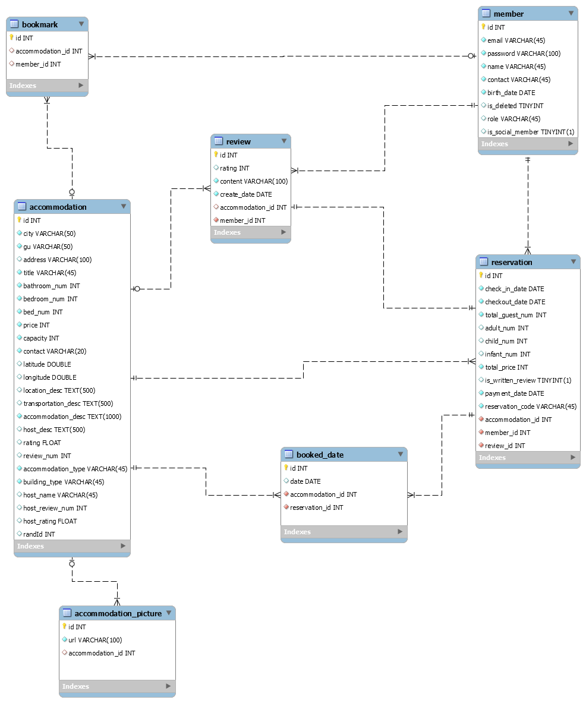

# SweetyPie, Airbnb Clone Project
> 기존의 숙소 예약 사이트, airbnb를 클론하는 프로젝트입니다.

## 프로젝트 기간
- 기획: 21.01.25 ~ 21.01.29
- 개발: 21.02.01 - 21.02.26

## 구성원
- [이재복](https://github.com/Tezla-Lee)
- [나영원](https://github.com/FoeverNa)
- [임준철](https://github.com/limjoonchul)

## 프로젝트 목표
### 공통 목표
- 백엔드와 프론트엔드의 협업 및 원활한 의사소통 능력 향상
- 규모있는 웹 애플리케이션의 기획부터 배포 경험 축적
- 서비스의 핵심 기능 구현을 통한 완성도있는 프로젝트 구현
### 백엔드 목표
- RESTful 한 API 구현
- 각 기능에 적합한 TEST 구현
- 도메인 분석 및 DB 설계

## Skills & Tools
- Java
- Python
- Spring
- Spring Boot
    - Spring Security
    - Spring JWT
- JPA
- AWS
    - EC2
    - S3
    - Code Deploy
- MySQL
- H2
- Redis
- Git
- Github
- Git flow
- IntelliJ
- Slack
- Notion
- Zoom

## DB 구조 (ERD)
